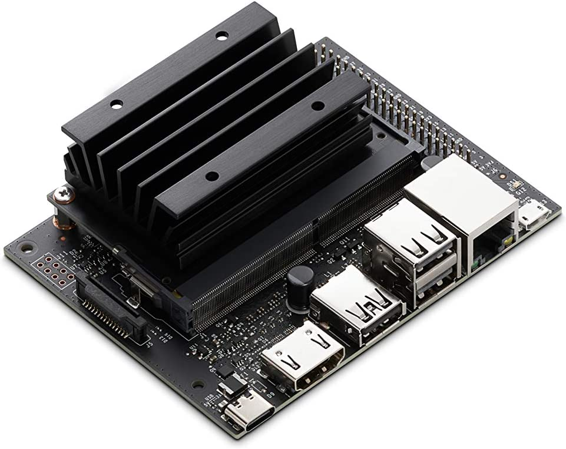
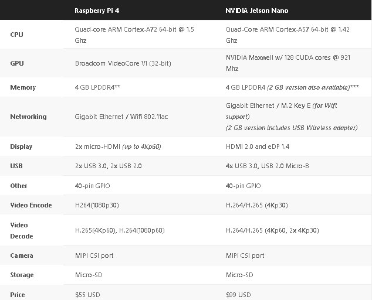
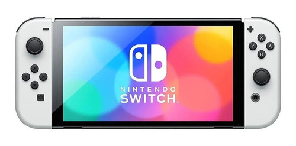
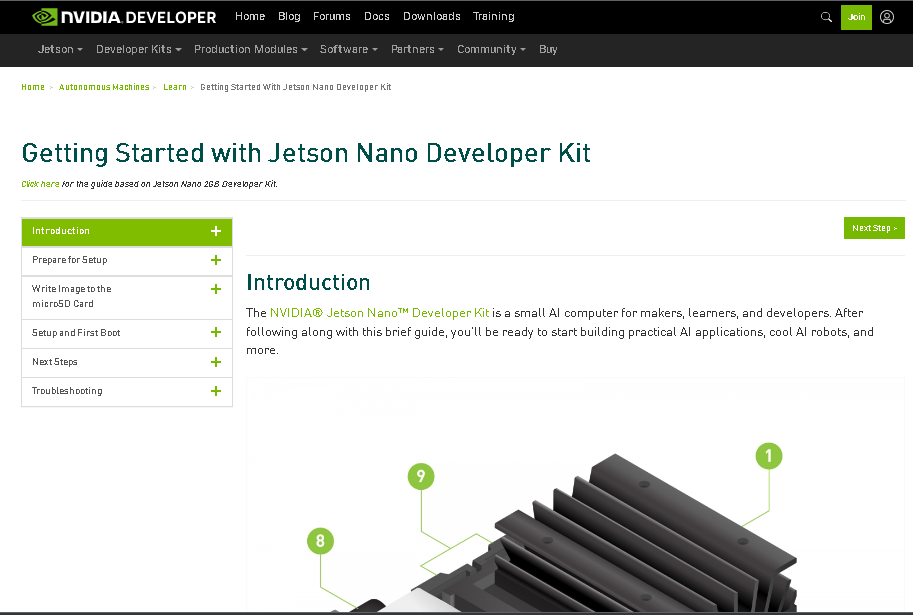

## O que vamos ver neste lab?

- Nvidia Jetson Nano: 
    - O que é isso?
    - Como dar boot 
    - Visão computacional na Jetson Nano 


!!! progress
    Continuar...


## Afinal, o que é Jetson Nano?

Basicamente, o ``NVIDIA Jetson Nano Developer Kit`` é uma SBC que fornece uma solução de computação completa (com GPU integrada), logo pode ser utilizada para desenvolver/prototipar soluções em diversas areas. Assim como a Raspberry Pi, temos um SO completo e acesso a perifericos e GPIO.

Para quem gosta de hardware, abaixo temos algumas informações comparando a especificações da Jetson Nano com oa Raspberry Pi. 
 





!!! exercise
    Compare as espec. dos dois SBC. Quais as maiores diferenças encontradas?


Em uma análise rápida, podemos ver que as duas specs são parecidas, com exceção de um. A maior diferença nos recursos de computação e gráficos entre essas duas placas é que o NVIDIA Jetson Nano inclui uma GPU (processador gráfico) de maior desempenho e capacidade, enquanto o Raspberry Pi 4 possui uma GPU multimídia integrada de baixo consumo de energia.


!!! info
    

    Se você gosta de video game, provavelmente conhece o Nintendo Switch. O hardware do Switch é bem similar a Jetson Nano pois a GPU NVIDIA Maxwell com 128 núcleos CUDA do Jetson Nano é na verdade a mesma GPU encontrada no Nintendo Switch. 

    A CPU Cortex-A57 também é a mesma. A diferença é que o Nintendo Switch possui quatro núcleos Cortex-A53 adicionais em seu hardware NVIDIA Tegra X1 SoC (System on a Chip).


!!! progress
    Continuar...


A NVIDIA possui uma documentação oficial bem completa e detalhada desde setup e os primeiros passos até suporte para aspectos avançados com a Jetson Nano. Calma!!! nas primeiras iterações com a documentação, sites e foruns é normal ter um pouco de confusão e não encontrar as respostas desejadas, mas com um pouco de prática (e paciência...) fica fácil. Desta forma, bora navegar nesse oceano de informações da NVIDIA. 




## Como dar boot???

!!! exercise
    No seu notebook, acesse o site [https://developer.nvidia.com/embedded/learn/get-started-jetson-nano-devkit#intro](https://developer.nvidia.com/embedded/learn/get-started-jetson-nano-devkit#intro) e siga o passo-a-passo para realizar o boot da Jetson Nano.


!!! info
    Embora sejá uma etapa simples, o download pode demorar bastante,  por esse motivo, vamos pular essa parte. Na teoria, as Jetson Nano já estáo com o boot feito.


!!! progress
    Continuar...


### HELLO WORLD! Ligando a placa...

O SO é basicamente um Linux Ubuntu 18.04 com algumas otimizações para ficar combativel com a Jetson Nano. 


!!! exercise
    Inicialize a Jetson Nano, não esqueça de ligar o monitor, teclado e mouse. Essas Jetson Nanos são utilizadas no labotório de informatica e algumas configurações já foram alteradas, como login e senha. 
    - o login é ``nuc404`` e a senha é ``t0rt1g4`` 

!!! exercise
    Com a jetson inicializada, se ambiente com o sistema operacional. Conecte-se na internet, faça a atualização de pacotes(apt update)....


!!! progress
    Continuar...
 

## Pisca led

A jetson possui os GPIO para realizar conexões com sensores e atuadoes. A pinagem fisica segue a mesma da Raspberry Pi. As funções e métodos da biblioteca tambem são iguais as da raspberry. 

!!! exercise
    - Instale a bibliote seguindo os passos definidos [neste guia https://github.com/NVIDIA/jetson-gpio](https://github.com/NVIDIA/jetson-gpio).
    - Nonte o circuito pisca led da aula anterior utilizado na raspberry pi.
    - Rode o seu script python na jetson nano para piscar o led.

Dica extra:
    - [Usando os GPIO](https://maker.pro/nvidia-jetson/tutorial/how-to-use-gpio-pins-on-jetson-nano-developer-kit)


!!! progress
    Continuar...


## Deep Learning na borda!

O processamento de video na Jetson Nano é bastante eficiente devido a GPU que eleva a performance e o processamento.

### Detecção de objetos

Abra o terminal e digite: 

```bash

sudo apt update
sudo apt-get install git cmake libpython3-dev python3-numpy

```  

agora vamos clonar um repositorio com os modelos pre treinados de DNN:

```bash

git clone --recursive https://www.github.com/dusty-nv/jetson-inference.git
cd jetson-inference
mkdir build && cd build
cmake ../

make
sudo make install    
sudo ldconfig

```  

Fazendo um teste para verificar se deu tudo certo....

```bash

cd jetson-inference/build/aarch64/bin
python my-detection.py

```  

fonte [link](https://maker.pro/nvidia-jetson/tutorial/deep-learning-with-jetson-nano-real-time-object-detection-and-recognition)


